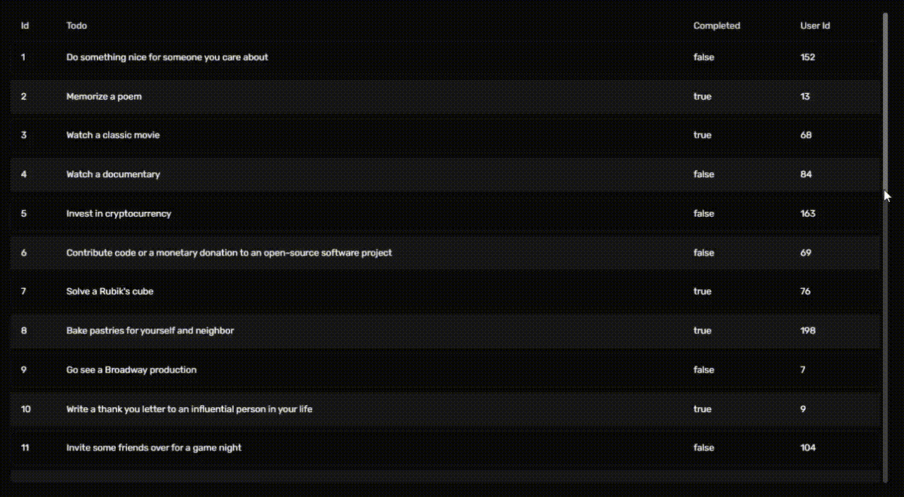

# @koijs/table-vue 🚀
🌍 [koijs.com](https://koijs.com)

**This is an alpha release.** ⚠️

`@koijs/table-vue` is a highly customizable and lightweight table component designed for Vue.js. It provides built-in features like sticky headers, zebra rows, and flexible sizing, making it an ideal choice for data-heavy applications. This package automatically generates table headers based on the provided data, eliminating the need for manual header definitions and ensuring a seamless experience. It is currently under development but is available as an alpha release.

## ⛓️‍💥 Dependencies
 - [tailwindcss v4.0](https://tailwindcss.com/)

## 📦 Installation

You can install the alpha version using the following command:

```sh
npm install @koijs/table-vue
```

## 🚀 Usage

Here is a demonstration of `@koijs/table-vue` in action:



Here is a basic example of how to use `@koijs/table-vue` in your Vue project:

```vue
<script setup>
import KoiTable from '@koijs/table-vue'
import { ref } from 'vue'

const tableData = ref([
  { id: 1, name: 'Alice', age: 25 },
  { id: 2, name: 'Bob', age: 30 },
  { id: 3, name: 'Charlie', age: 35 }
])
</script>

<template>
  <KoiTable
    :rows="tableData"
    class="whitespace-nowrap"
  />
</template>
```

Development is ongoing, but the basic features can be tested. 🛠️

## ⚙️ Props

| Prop       | Default Value   | Description |
|------------|-----------------|-------------|
| sticky     | true            | 📌 Keeps the table header fixed at the top when scrolling, allowing users to track column headers while navigating data. |
| zebraRows  | true            | 🎨 Alternates row colors to improve readability. |
| spacing    | true            | 📏 Adds spacing between rows for a more open and readable layout. |
| size       | `{ xs: { text: 'text-xs' }, sm: { text: 'text-sm' }, md: { text: 'text-md' }, lg: { text: 'text-lg' }, xl: { text: 'text-xl' } }` | 🔠 Defines the text size for the table. |
| border     | `{ body: false, horizontal: false, vertical: false }` | 🔲 Determines whether borders are displayed inside table cells. |
| mark       | `{ hover: { row: true, column: false }, select: { row: false, column: false }, spotlight: false }` | ✨ Defines highlighting behavior when hovering or selecting rows and columns. |

## 🎨 UI (prop)

```json
{
  "wrapper": "w-full relative overflow-x-auto pr-1 rounded-lg dark:text-white text-black",
  "sticky": {
    "animation": "duration-300",
    "base": "sticky top-0",
    "header": "dark:bg-neutral-800/90 bg-neutral-200/90 py-3 first:rounded-l-lg last:rounded-r-lg"
  },
  "zebraRows": "even:bg-neutral-100 odd:bg-white dark:even:bg-neutral-900 dark:odd:bg-neutral-950",
  "spacing": {
    "base": "border-separate border-spacing-y-2",
    "row": "inset-ring dark:inset-ring-neutral-900 inset-ring-neutral-100",
    "shadow": "shadow",
    "rounded": "rounded-lg"
  },
  "border": {
    "body": "ring ring-neutral-300 dark:ring-neutral-700",
    "horizontal": "border-y border-neutral-300 dark:border-neutral-700",
    "vertical": "border-x border-neutral-300 dark:border-neutral-700"
  },
  "size": {
    "xs": { "text": "text-xs" },
    "sm": { "text": "text-sm" },
    "md": { "text": "text-md" },
    "lg": { "text": "text-lg" },
    "xl": { "text": "text-xl" }
  },
  "mark": {
    "hover": {
      "row": "hover:bg-zinc-200 dark:hover:bg-zinc-800",
      "column": "bg-zinc-200 dark:bg-zinc-800"
    },
    "select": {
      "row": "even:bg-zinc-200 odd:bg-zinc-200 dark:even:bg-zinc-800 dark:odd:bg-zinc-800",
      "column": "bg-zinc-200 dark:bg-zinc-800"
    },
    "spotlight": "bg-zinc-300 dark:bg-zinc-600"
  },
  "table": {
    "base": "min-w-full table-fixed"
  },
  "scrollbar": {
    "base": "[&::-webkit-scrollbar]:h-2 [&::-webkit-scrollbar]:w-2",
    "corner": "[&::-webkit-scrollbar-corner]:bg-transparent",
    "thumb": {
      "base": "[&::-webkit-scrollbar-thumb]:bg-neutral-300 dark:[&::-webkit-scrollbar-thumb]:bg-neutral-500",
      "rounded": "[&::-webkit-scrollbar-thumb]:rounded-lg"
    },
    "track": {
      "base": "[&::-webkit-scrollbar-track]:bg-neutral-100 dark:[&::-webkit-scrollbar-track]:bg-neutral-700",
      "rounded": "[&::-webkit-scrollbar-track]:rounded-lg"
    }
  },
  "header": {
    "base": "select-none",
    "tr": "",
    "th": {
      "base": "text-left font-normal dark:text-neutral-200 text-neutral-800 whitespace-nowrap",
      "padding": "py-1 px-2 first:pl-4 last:pr-4"
    }
  },
  "body": {
    "base": "",
    "tr": {
      "base": "",
      "hover": ""
    },
    "td": {
      "base": "",
      "padding": "px-2 py-4 first:pl-4 last:pr-4"
    }
  }
}
```

## ⚙️ Slots

| Slot       | Return   | Description |
|------------|-----------------|-------------|
| `<data-key>-cell`      | column, data            | 🎨  Allows customization of individual table cells. The column parameter provides column-specific information, while data holds the corresponding row data. Useful for formatting or applying conditional styling. |
| `<column-key>-header`  | column            | 📌 Enables customization of table headers. The column parameter contains the header label, allowing modifications such as icons, tooltips, or additional styling. |

## 💡 Support & Contributions

If you would like to support the project, report issues, or contribute, here are some ways you can help:

- ⭐ **Star the repository**: Show your support by starring the project on [GitHub](https://github.com/protokoi/koijs-table.vue).
- 🚀 **Feature Requests**: Have an idea for improvement? Submit your feature requests as an [issue](https://github.com/protokoi/koijs-table.vue/issues).

Your contributions and feedback help make `@koijs/table-vue` better! 💙

For more details and updates, visit [koijs.com](https://koijs.com). 🌍
